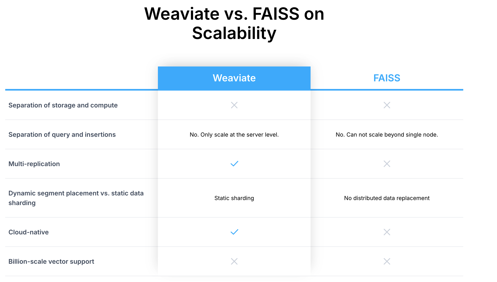

# 
Weaviate vs FAISS

FAISS: https://ai.meta.com/tools/faiss/: 

https://zilliz.com/comparison/weaviate-vs-faiss



weaviate :
both text2vec-openai for vector-related operations and generative-cohere for the generative module.
text2vec-openai and text2vec-transformers both can support "ASK" task use either one

Transformer needs to be configured in docker-compose.xml and for collection , otherwise, can't answer "ASK" . We can update class , and reload file to have index re-generated.

```
python
# Initialize Weaviate client
client = weaviate.Client("http://localhost:8080")


# Update the schema to set the vectorizer to text2vec-transformers
client.schema.update_class({
    "class": "PDF_COLLECTION",
    "vectorizer": "text2vec-transformers"
})


```

### keywords for retrival
```
    1. nearVector
    2. ask
    3. bm25: keyword-based BM25 
    4. nearImage
    5. hybrid: keyword-based BM25 search with vector-based search for a hybrid approach that considers both vector distances and keyword relevance.
    6. where - filtering objects

```

### text2vec-openai vs text2vec-transformers (open source BERT, RoBERTa, Sentence-Transformers)
```
Which One is Better?

    Use text2vec-openai if:
        You prioritize accuracy and ease of use.
        Cost is not a significant concern, and you’re okay with relying on an external API.
        You want the best possible semantic understanding with little to no fine-tuning or customization.

    Use text2vec-transformers if:
        You need a cost-effective and self-hosted solution.
        You want low latency and control over infrastructure.
        You’re comfortable managing and fine-tuning transformer models, or you have a specific transformer model in mind that suits your needs.

Hybrid Approach:

You could also consider a hybrid approach, where you use text2vec-transformers for most of your use cases (to save costs and reduce latency) and switch to text2vec-openai for specific, high-accuracy, and nuanced tasks that require a deeper understanding of text.
```